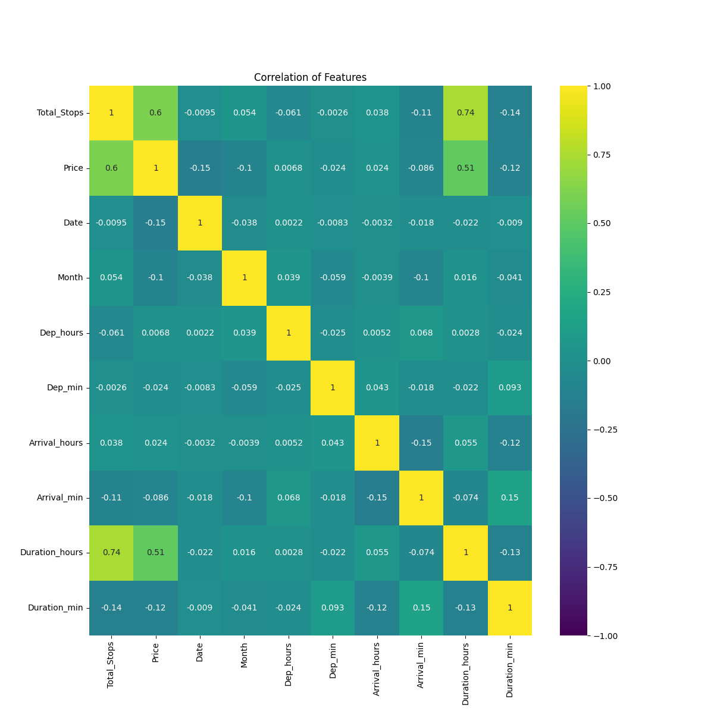
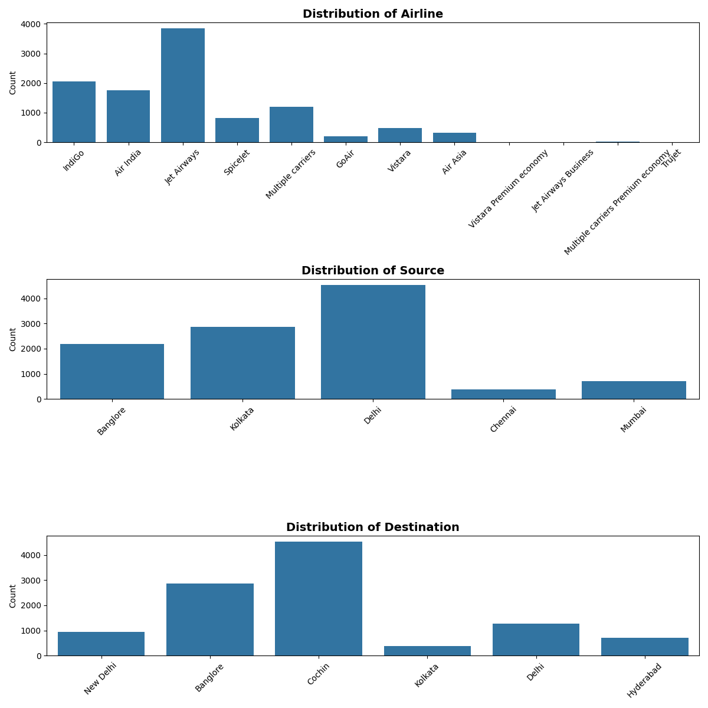
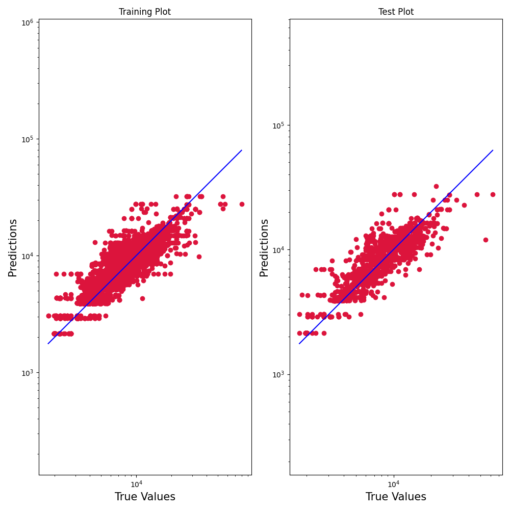
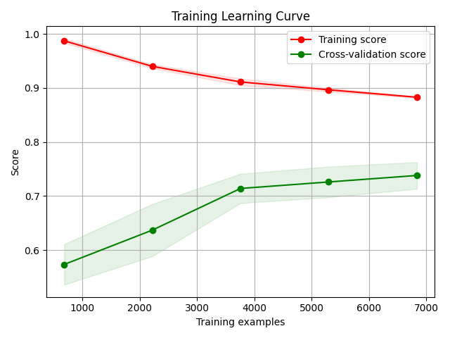
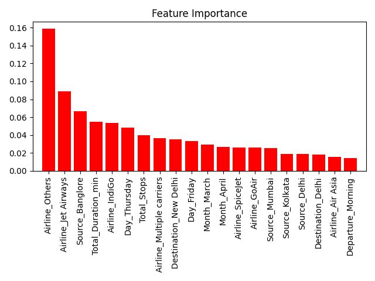

# Flight Price Prediction Project

This repository focuses on cleaning flight ticket data and training models using Scikit-learn to predict correct flight ticket prices.

<br><br><br>
## Project Structure

├── main_files\
│   ├── data_info_and_plots\
│   │   ├── data_info.txt\
│   │   ├── plot_category_data_distribution.png\
│   │   ├── plot_correlation_heatmap.png\
│   │   ├── plot_distribution.png\
│   │   ├── plot_feature_importance.png\
│   │   ├── plot_learning_curve.png\
│   │   ├── plot_outliers.png\
│   │   ├── plot_partial_dependence.png\
│   │   └── plot_residuals.png\
│   ├── data_processing.py\
│   ├── flight_dataset.csv\
│   ├── __init__.py\
│   ├── main.py\
│   ├── models\
│   │   ├── linear_regression_model.joblib\
│   │   ├── tree_regressor_model.joblib\
│   │   └── xgbregressor_model.joblib\
│   ├── plotting.py\
│   ├── __pycache__\
│   └── train.py\
├── notebooks\
│   ├── flight_dataset_for_notebook.csv\
│   └── model_prototyping.ipynb\
├── poetry.lock\
├── pyproject.toml\
├── README.md\
└── tests\
    ├── __init__.py\
    ├── __pycache__\
    └── test_main.py\

<br><br><br>
## Installation

To install this project, use [Poetry](https://python-poetry.org/). Follow these steps:

1. **Install Poetry**: 
   If you don't have Poetry installed, you can install it by following the instructions on the [Poetry website](https://python-poetry.org/docs/#installation).

2. **Install Dependencies**:
   Once you have Poetry installed, navigate to the project directory and run:
   
   ```sh
   poetry install

<br><br><br>
## Data Processing Functions

### `one_hot_encoding_category_data(database)`
**Description**: Performs one-hot encoding on the 'Airline', 'Source', and 'Destination' columns of the dataset.

**Parameters**:
- `database`: The input DataFrame.

**Returns**: A DataFrame with one-hot encoded categorical features.

---

### `categorize_hour(hour)`
**Description**: Categorizes an hour into 'Morning', 'Afternoon', 'Evening', or 'Night'.

**Parameters**:
- `hour`: The hour to categorize.

**Returns**: The category as a string.

---

### `calculate_day_of_week(row)`
**Description**: Calculates the day of the week for a given row.

**Parameters**:
- `row`: The input row from the DataFrame.

**Returns**: The day of the week as a string.

---

### `process_time_data(database)`
**Description**: Processes time-related data, including total duration, departure and arrival times, and encoding them.

**Parameters**:
- `database`: The input DataFrame.

**Returns**: A DataFrame with processed time-related features.

---

### `categorize_day(day)`
**Description**: Categorizes a day into 'first_week', 'second_week', 'third_week', or 'fourth_week'.

**Parameters**:
- `day`: The day to categorize.

**Returns**: The category as a string.

---

### `split_scale_data(database, y_column)`
**Description**: Splits the data into training and testing sets and scales the features.

**Parameters**:
- `database`: The input DataFrame.
- `y_column`: The target column.

**Returns**: Scaled training and testing sets and target values.

<br><br><br>
## Plotting Functions

### `print_data_info(database)`

**Description**: Prints and saves information about the dataset, including data types, head rows, description, and null values.

**Parameters**:
- `database`: The input DataFrame.

---

### `plot_distribution_info(database)`

**Description**: Plots and saves the distribution of numerical features in the dataset.

**Parameters**:
- `database`: The input DataFrame.

---

### `plot_for_outliers(database)`

**Description**: Plots and saves boxplots for numerical features to identify outliers.

**Parameters**:
- `database`: The input DataFrame.

---

### `plot_correlation_heatmap(database)`

**Description**: Plots and saves a heatmap showing the correlation between numerical features.

**Parameters**:
- `database`: The input DataFrame.

---

### `plot_category_data_distribution(database)`

**Description**: Plots and saves the distribution of categorical features.

**Parameters**:
- `database`: The input DataFrame.

<br><br><br>
## Training Functions

### `train_linear_regression(X_train, X_test, y_train, y_test, path="models/linear_regression_model.joblib")`
**Description**: Trains a linear regression model using GridSearchCV and saves the model.

**Parameters**:
- `X_train`: Training features.
- `X_test`: Testing features.
- `y_train`: Training targets.
- `y_test`: Testing targets.
- `path`: Path to save the trained model.

**Returns**: The trained model.

---

### `train_xgbregressor(X_train, X_test, y_train, y_test, path="models/xgbregressor_model.joblib")`
**Description**: Trains an XGBRegressor model using RandomizedSearchCV and saves the model.

**Parameters**:
- `X_train`: Training features.
- `X_test`: Testing features.
- `y_train`: Training targets.
- `y_test`: Testing targets.
- `path`: Path to save the trained model.

**Returns**: The trained model.

---

### `train_tree_regressor(X_train, X_test, y_train, y_test, path="models/tree_regressor_model.joblib")`
**Description**: Trains a DecisionTreeRegressor model using RandomizedSearchCV and saves the model.

**Parameters**:
- `X_train`: Training features.
- `X_test`: Testing features.
- `y_train`: Training targets.
- `y_test`: Testing targets.
- `path`: Path to save the trained model.

**Returns**: The trained model.

<br><br><br>
## Result Plotting Functions

### `plot_residuals(model, X_train, X_test, y_train, y_test, path="data_info_and_plots/plot_residuals.png")`

**Description**: Plots and saves residuals for the training and testing data.

**Parameters**:
- `model`: The trained model.
- `X_train`: Training features.
- `X_test`: Testing features.
- `y_train`: Training targets.
- `y_test`: Testing targets.
- `path`: Path to save the plot.

---

### `plot_learning_curve_for_model(model, X_train, y_train, path="data_info_and_plots/plot_learning_curve.png")`

**Description**: Plots and saves the learning curve for the model.

**Parameters**:
- `model`: The trained model.
- `X_train`: Training features.
- `y_train`: Training targets.
- `path`: Path to save the plot.

---

### `plot_feature_importance_for_model(model, X_train, path="data_info_and_plots/plot_feature_importance.png")`

**Description**: Plots and saves the feature importance for the model.

**Parameters**:
- `model`: The trained model.
- `X_train`: Training features.
- `path`: Path to save the plot.

---

### `plot_partial_dependence(model, X_train, path="data_info_and_plots/plot_partial_dependence.png")`

**Description**: Plots and saves the partial dependence plots for the model.

**Parameters**:
- `model`: The trained model.
- `X_train`: Training features.
- `path`: Path to save the plot.

<br><br><br>
## Running Tests

This project uses `pytest` for testing. Follow these instructions to run the tests.
To run all tests in the tests directory, use:
```sh
pytest
